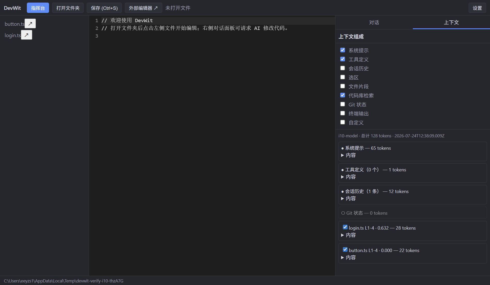
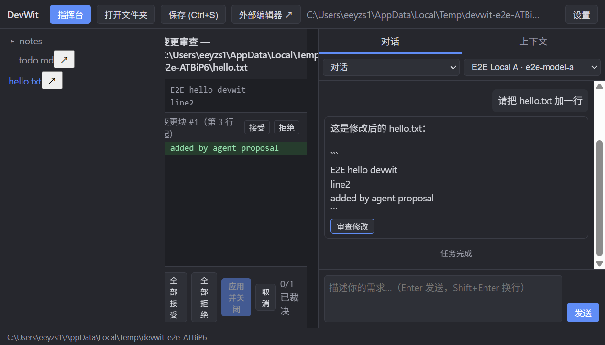
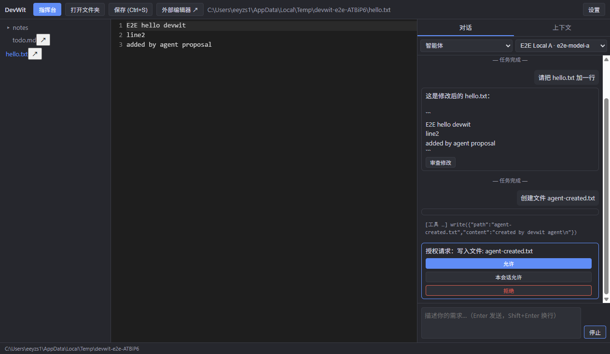
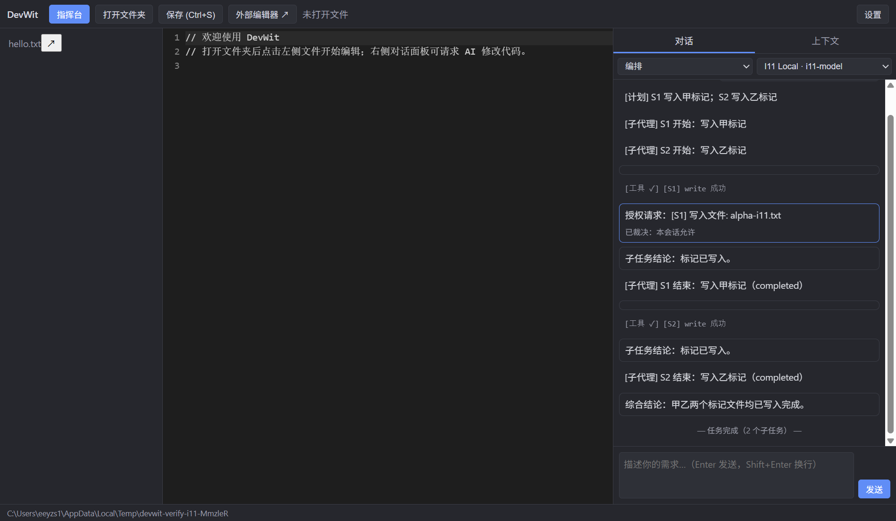
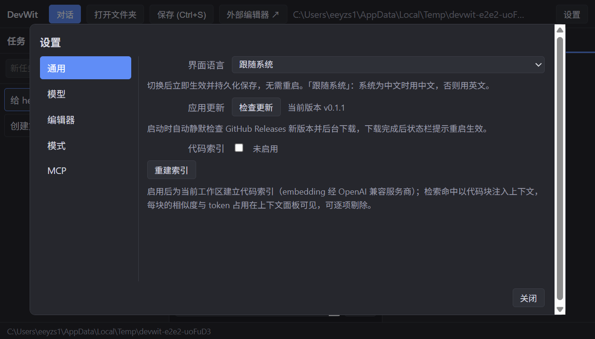
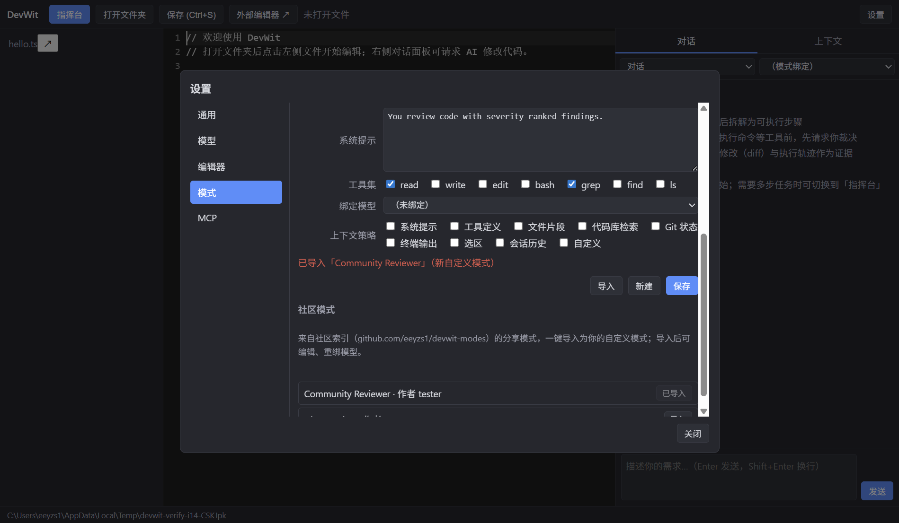

# DevWit — 简洁上下文 AI 原生桌面 IDE

[English](generated/devwit/README_EN.md)

[](https://github.com/eeyzs1/DevWit/releases)
[](https://github.com/eeyzs1/DevWit/releases)
[](https://github.com/eeyzs1/DevWit/stargazers)
[](generated/devwit/LICENSE)
[](https://github.com/eeyzs1/DevWit/actions/workflows/ci.yml)

DevWit 是一款自研的 AI 原生桌面 IDE，建立在一条原则上：**AI 看到什么、做什么，你都看得一清二楚**。每次 LLM 请求的完整上下文（系统提示、工具列表、注入项）逐项可见、带 token 计量、可逐项关闭；每次文件写入和终端命令都需你一键批准。融合 VSCode 的编辑器能力、Cursor 的对话式编程与 Claude Code 的 Agent 执行，避免长上下文膨胀。

**免费软件 · MIT 协议 · 无账号无云同步 · 遥测默认关闭**

## 为什么选 DevWit

| 关切 | Cursor / Copilot | DevWit |
|------|------------------|--------|
| 上下文透明度 | 黑盒，看不到发什么 | **逐项可见**：系统提示、工具、注入项及每项 token 占用全展示，可逐项开关 |
| 操作授权 | Agent 直接执行 | **授权门**：文件写入 / 终端命令需一键批准，裁决留痕可审计 |
| 上下文成本 | 塞满即用，token 失控 | **简洁上下文**：每项 token 可见可关，请求体积主动控制 |
| 定位 | 插件或闭源 SaaS | **独立 IDE**，MIT 开源，零账号零云端，数据不出本机 |
| 合规/审计 | 无 | 上下文 manifest 落盘 + 授权轨迹完整可追溯 |

## 下载安装

**最新版本 v0.5.0**（全部构建产物见 [Releases](https://github.com/eeyzs1/DevWit/releases/tag/v0.5.0)）

### Windows（x64）

直接下载：[DevWit.Setup.0.5.0.exe](https://github.com/eeyzs1/DevWit/releases/download/v0.5.0/DevWit.Setup.0.5.0.exe)（NSIS 安装包，支持应用内自动更新）。

> **SmartScreen**：当前未代码签名。若提示「Windows 已保护你的电脑」→ **更多信息** → **仍要运行**。构建来自公开 GitHub Actions；Star 有助于申请免费签名。

winget（已提交 microsoft/winget-pkgs#407506，待社区审批通过后可用）：

```powershell
winget install eeyzs1.DevWit
```

### macOS（Apple Silicon）

```bash
brew install --cask eeyzs1/tap/devwit
xattr -dr com.apple.quarantine /Applications/DevWit.app   # 未签名分发，首次运行前去一次隔离
```

或直接下载：[DevWit-0.5.0-arm64.dmg](https://github.com/eeyzs1/DevWit/releases/download/v0.5.0/DevWit-0.5.0-arm64.dmg)。

### Linux（x64）

- AppImage（支持应用内自动更新）：[DevWit-0.5.0.AppImage](https://github.com/eeyzs1/DevWit/releases/download/v0.5.0/DevWit-0.5.0.AppImage)，`chmod +x` 直接运行
- Debian/Ubuntu：[devwit_0.5.0_amd64.deb](https://github.com/eeyzs1/DevWit/releases/download/v0.5.0/devwit_0.5.0_amd64.deb)，`sudo dpkg -i` 安装

## 核心特性

| 特性 | 说明 |
|------|------|
| 简洁上下文引擎 | 每次 LLM 请求的完整上下文组成逐项可见（系统提示/工具/注入项 + 各项 token 占用），可逐项开关，manifest 落盘可审计 |
| 授权门 | Agent 读写文件、执行终端命令均需用户批准，裁决留痕于执行轨迹；高频安全命令可学习免重复确认 |
| 对话式编程 | 对话请求代码修改，diff 形式在编辑器内呈现，逐块接受/拒绝 |
| 自研编辑器内核 | piece-table 文本缓冲 + Canvas 渲染 + tree-sitter 高亮，支持 IME 中文输入、多光标 |
| 代码智能 | TypeScript LSP（悬停/跳转定义/实时诊断）、集成 Git（状态/diff/暂存提交）、断点调试（DAP/js-debug） |
| 多 Agent 编排 | 「指挥台」自动拆解任务为并行子代理，计划与进度在活动流逐项可见 |
| 透明 RAG | 代码库索引检索命中以相似度与 token 占用逐项展示、可逐项剔除 |
| 零成本模型接入 | 预设一键填充 Ollama 本地免 key、DeepSeek、OpenRouter 免费档；Anthropic 与 OpenAI 兼容 API 双协议，key 经 safeStorage 加密 |
| 模式自定义 | 每个模式独立定义系统提示、工具集、模型与上下文注入策略，热生效；JSON 导出/导入 + 社区索引一键导入 |
| MCP 服务器 | 设置页管理 MCP 服务器（CRUD + 状态徽标 + 工具计数），MCP 工具经授权门并入 Agent 工具集 |
| 国际化 | 界面中英双语热切换；主进程错误以 ASCII 错误码输出，渲染端按当前语言本地化 |

## 界面一览

| 透明上下文 + RAG | 对话 diff 审查 |
|---|---|
|  |  |

| Agent 授权门 | 多 Agent 编排 |
|---|---|
|  |  |

| 统一设置页 | 社区模式一键导入 |
|---|---|
|  |  |

## 开发与文档

产品完整文档（快速开始、测试与验证、打包发布、安全设计）见 [generated/devwit/README.md](generated/devwit/README.md)。

```powershell
cd generated/devwit
npm install
npm run rebuild-native   # 编译 node-pty 原生模块（Electron ABI）
npm run dev              # 构建并启动
```

质量基线：747 项单元测试 / 69 测试文件 + 多套 E2E，CI 验证门禁全绿。贡献指南见 [CONTRIBUTING.md](CONTRIBUTING.md)。

## 支持

DevWit 是免费开源软件，不商业化、不收费、不追踪。如果它对你有帮助，欢迎 ⭐ Star——这是项目继续迭代和通过代码签名（SignPath）审核的公信号依据。问题与建议请提 [Issue](https://github.com/eeyzs1/DevWit/issues)。

## 仓库结构

本仓库包含两部分：

- **`generated/devwit/`** — DevWit 产品本体（Electron 37 + TypeScript 5.8 monorepo），即本页介绍的 IDE
- **Meta-Harness 框架**（`meta/` `seeds/` `scripts/` 等）— 生成 DevWit 的自进化 Harness 工程框架，文档见 [META-HARNESS.md](META-HARNESS.md) / [META-HARNESS_EN.md](META-HARNESS_EN.md)
